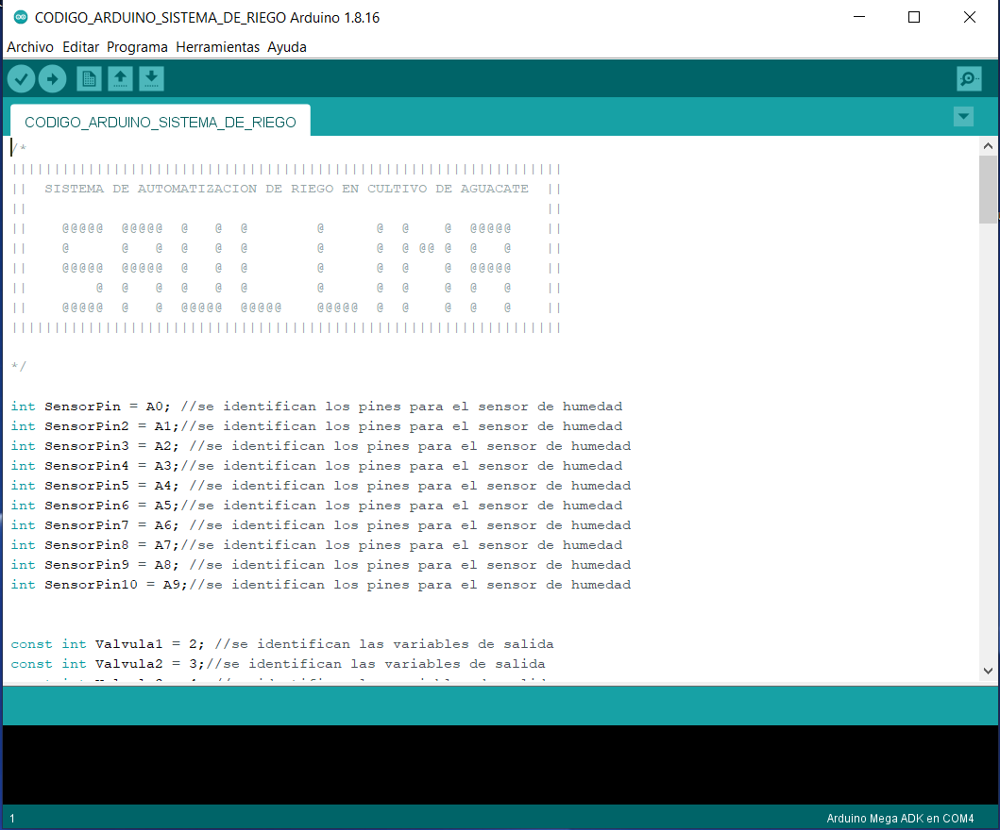

# Sistema de Riego Automatizado en Plantacion de Aguacate
Saul Ramiro Lima Toledo

  

<h1>IDE ARDUINO</h1>

  

Para poder utilizar el codigo implementado se necesita el siguiente paso:

<h3>Paso #1</h3>
Descargar el IDE de Arduino
Dejo el link de la descarga a continuacion:

https://www.arduino.cc/en/software

En dicho link se encuentran las diferentes versiones y las plataformas segun tu equipo.

<h1>ABRIR EN ARDUINO IDE</h1>

<h3>Paso #1</h3>
Abrir IDE de Arduino

  

 
<h3>Paso #2</h3>
Seleccionar la opcion abrir y buscar el archivo ".ino" que se encuentra en este repositorio

  

<h3>Paso #3</h3>
Ya abierto el codigo podremos cargarlo a nuestra placa Arduino

  

